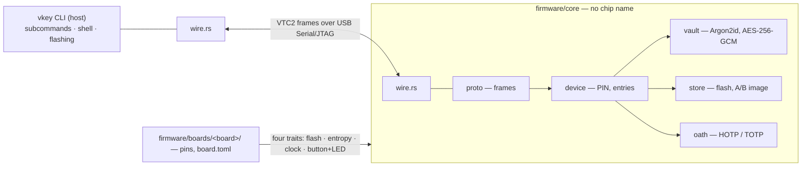

# vkey — a hardware key for TOTP codes, passwords and `.env` files

An open-source USB-C security key on a Waveshare ESP32-C6-Zero, with bare-metal Rust
firmware and a single-binary host CLI.

> **Status: a personal key, not a product** (2026-09-07). It runs on real hardware, its TOTP is
> checked against the RFC 6238 vectors, and the author uses it for his own accounts. No sales, no
> batch, no certification. Read [docs/threat-model.md](docs/threat-model.md) before relying on it,
> and keep the recovery codes your services give you.

## How it works



`wire.rs` is one file compiled on both ends of the cable: a command, error code or flag
that is not in it exists on neither side. The device has no clock — the host sends the time.

## What it is

- **TOTP secrets**, **passwords** (login, password, note) and whole project **`.env` files**,
  encrypted with AES-256-GCM.
- The key comes from a 6–8 digit PIN through Argon2id (128 KiB) and an HMAC key burned into eFuse,
  so a flash dump without the chip is useless. JTAG is disabled; Secure Boot v2 (RSA-3072) is on;
  Flash Encryption is deliberately not used.
- Every code, password and `.env` needs a button gesture. Eight wrong PINs wipe everything.
- A TOTP secret goes in once and never comes out in the clear — there is no command for it. The one
  way out is `vkey backup`, which reseals every item under a backup passphrase.
- Everything, `list` included, needs the PIN; the key re-locks after two idle minutes. Secrets and
  PINs are never arguments or environment variables — hidden prompt or stdin.

## What it does not do

Read [docs/threat-model.md](docs/threat-model.md) **before** you depend on this.

- **Nothing against phishing.** A TOTP code works on a fake site just as on the real one; that is a
  property of TOTP. WebAuthn resists it, and this hardware cannot: the C6's USB is a fixed
  Serial/JTAG port with no HID.
- **Nothing for the code or password you just received** — it crosses the host: terminal, optionally
  the clipboard (cleared after 30 s).
- ESP32 is **not a secure element.** Against power glitching and side channels it does not hold; a
  public Secure Boot glitch bypass for ESP32-C3/C6 exists (Espressif AR2023-007). Download mode
  stays open on purpose: anyone holding the board can rewrite the flash.
- A backup is only the `.vkb` file you made: with the passphrase it is every secret, without it the
  file opens nowhere.
- No NFC, no phone — USB-C to a computer only. Against a state actor, or someone with a soldering
  iron, buy a certified key with a secure element instead.

## Install

One static binary, no Python and no ESP-IDF; the firmware image is embedded in it.

```bash
curl -fsSL https://github.com/vaulttec-dev/vaulttec-key/releases/latest/download/install.sh | sh
```

x86_64 Linux. The script checks the download against the published `SHA256SUMS` and
refuses to install on a mismatch, needs no root, and writes only `~/.local/bin/vkey`.
[Read it first](install.sh) — you should, for any piped installer.

From source, which needs only Rust ([rustup](https://rustup.rs)):

```bash
git clone https://github.com/vaulttec-dev/vaulttec-key.git
cd vaulttec-key/cli && cargo build --release && ./target/release/vkey install
```

Either way, put `~/.local/bin` on your PATH and run `sudo usermod -aG dialout $USER`, then
log back in — without that group the serial port will not open.

## Quick start

Plug a bare board in over USB-C and run `vkey setup`: it flashes the firmware, asks for a PIN and
runs the self-test. `vkey` alone opens the shell, where an entry's name *is* a command: `github` +
Enter gives a code after a tap; `mail` + Enter gives the login at once and the password after a tap.
Empty Enter opens the entries as a menu with three tabs — TOTP, Passwords, ENV — where `a` adds,
`e` edits, `d` deletes and `i` imports.

```bash
vkey totp add GitHub:me               # asks for the otpauth URI or base32; or: echo SECRET | vkey totp add name
vkey pass add mail --login me@example.com
vkey env add myapp .env               # or: wl-paste | vkey env add myapp
vkey get GitHub:me                    # a code; vkey get mail [--copy] for a login and password
vkey get myapp > .env                 # better without a file:  env $(vkey get myapp) npm start
vkey list · rm · info · lock · pin set/change · totp selftest · wipe
vkey import passwords.csv             # Google Password Manager or 1Password 8 export, one question per row
vkey backup vault.vkb                 # everything in one file, sealed on the key; two taps
vkey restore vault.vkb                # everything back, onto this key or a new one; PIN and passphrase
vkey check --wipe-everything          # lifecycle test on a board; ERASES EVERYTHING
```

A `.env` is stored as is and comes out whole after one tap; only `KEY=value` lines are accepted,
checked by the CLI. A CSV export is plaintext on disk before and after `vkey import`, and the CLI
does not delete it.

## Gestures and capacity

| Gesture | LED | What it releases |
|---|---|---|
| Tap | amber | one TOTP code, one password, or one `.env` |
| Hold 5 s | red | factory wipe: every secret and the PIN |
| Double tap | blue | the encrypted backup file |

A tap never wipes and never exports, so a hostile host cannot swap a code request for a
wipe or an export: the gesture the owner makes for one satisfies neither of the others.

| | Limit |
|---|---|
| Entries (TOTP secrets and passwords together) | 256 slots |
| `.env` blobs | 16, up to 8000 bytes each |
| Entry name | 32 bytes; names are one namespace |
| Login, password, note | 255 bytes each, 256 per entry in total |
| PIN | 6–8 digits, 8 attempts |

## Build

```bash
rustup target add riscv32imac-unknown-none-elf && cargo install espflash   # once
./tools/build-vaultkey.sh                     # every board, no-radio check, images into the CLI
./tools/sign-vaultkey.sh                      # Secure Boot: sign the images (PIN and a tap)
(cd cli && cargo build --release) && cli/target/release/vkey install && vkey setup
./tools/build-bootloader.sh                   # only when firmware/boards/*/bootloader/ changes (Docker)
```

The signing key lives on the key itself, as the `.env` entry `vkey-signing`. Acceptance after any
firmware change: `vkey totp selftest` green — one tap, destroys nothing. Before a release and on
every new board also `vkey check --wipe-everything`, which erases the device, so run that one on an
empty board and never on a key holding secrets. A new
board is a folder `firmware/boards/<name>/` with its pins, chip crates and `board.toml`; the CLI
picks it up at build time. Git hooks in `.githooks/` run fmt, clippy (`pedantic` as errors), tests,
shellcheck, the no-radio and wording checks, and prove the committed image equals a fresh build.

CI runs the same set on every pull request, plus `cargo audit` weekly, a spell check,
`actionlint` and `zizmor` over the workflows themselves. The job worth knowing about is
`images`: it rebuilds the firmware from source, fails if the committed binary differs by a
byte, and verifies both signed images against `firmware/secure-boot/public.pem` — no secret
involved, so anyone can repeat it. That is the only honest reason to trust a firmware image
published as a binary.

## Layout

| Path | What |
|---|---|
| `firmware/core/` | the key itself: protocol, PIN, crypto, storage, TOTP — no chip name |
| `firmware/boards/<board>/` | one folder per board: pins, chip crates, `board.toml`, images |
| `cli/` | the `vkey` command: subcommands, shell, flashing (espflash as a library) |
| `tools/` | build, signing and check scripts |

| Document | About |
|---|---|
| [docs/threat-model.md](docs/threat-model.md) | what it protects against and what it does not. **Read first** |
| [docs/hardware.md](docs/hardware.md) | the C6-Zero board: measured pins, traps, bringing up a new one |

## Security and licence

Report vulnerabilities privately — see [SECURITY.md](SECURITY.md). Please do not open a
public issue for anything in the crypto, PIN handling, storage or host protocol.

Licensed under [Apache-2.0](LICENSE).
