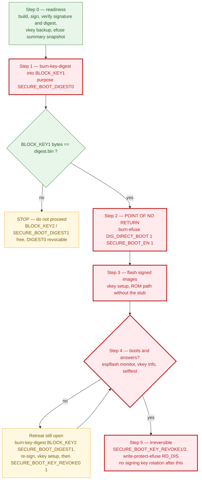

# Hardware: Waveshare ESP32-C6-Zero

One board, and this one (decision 2026-09-07). Everything here was measured on the board,
not read from a datasheet. Failures in this project are silent: a button on the wrong pin
simply "does not work" and never says why. Measure first, believe afterwards.

Threat analysis: [`threat-model.md`](threat-model.md). User-facing commands and capacity:
[`../README.md`](../README.md).

## What the board can and cannot do

For TOTP over USB-serial the C6 is a complete fit: the USB Serial/JTAG port shows up as a
serial device on any OS without drivers, and the `VTC2` protocol on top of it is ours.

**It cannot be USB HID**, and therefore cannot be a FIDO/passkey key: USB is a hard-wired
Serial/JTAG block, not reconfigurable into HID or any other class (USB OTG exists only on
S2/S3/P4). Software USB does not help: CTAPHID requires 64-byte packets, bit-banging gives
low-speed with 8. Closed; not revisited. **It has no radio code** either: Wi-Fi 6, BLE and
802.15.4 exist in silicon, but in bare-metal Rust they could only arrive through `esp-radio`,
and `tools/build-vaultkey.sh` fails the build if that crate appears in `firmware/Cargo.lock`.
Not "disabled in config" — absent.

| | ESP32-C6-Zero |
|---|---|
| Chip | ESP32-C6FH4 (QFN32) rev v0.1, RISC-V @ 160 MHz, 4 MB flash, no PSRAM |
| USB | Serial/JTAG straight into the chip; on the host `303a:1001`, `/dev/ttyACM*` |
| BOOT button | **GPIO9**, active low (not GPIO0 as on older ESP32); the label `BOOT` lives in `board.toml`, because the CLI names the button to the user |
| WS2812 | **GPIO8**, one LED, channel order **RGB** (not GRB) — the driver assumes GRB, so `main.rs` sets `color_order::Rgb`; ask for amber, get green, and it is diagnosed in a second |
| USB D−/D+ | GPIO12 / GPIO13 — do not touch |
| Security | Secure Boot v2, Flash Encryption, HMAC with a key in eFuse, hardware SHA/AES; no ECDSA peripheral |
| Form factor | USB-C **receptacle**: works over a cable like a devboard, not like a fob in a port |

LED colours (the rules live in `core/src/ui.rs`; the board only paints):

| Colour | Meaning |
|---|---|
| Amber | waiting for a short press (code, password or `.env`) |
| Red, held | wipe after five seconds |
| Blue | waiting for two presses in a row (backup) |
| Green flash / red flash | accepted / rejected |

## Flash layout

The bootloader reads only the app partition, so the partition table stays stock and describes
nothing else; firmware and CLI address the vault region absolutely through `esp-storage`. A
Secure Boot bootloader is 40 KiB plus 4 KiB of signature and does not fit before 0x8000, so
the table moved to **0xC000** with only `factory` in it; the plain bootloader was rebuilt at
the same offset so there is a single table for both.

```
0x000000  bootloader.bin | bootloader-sb.signed.bin
0x00C000  partition table (stock: factory only)
0x010000  factory app: vaultkey.bin | vaultkey.signed.bin
0x110000  +-- vault region, raw flash, 428 KiB = 107 sectors of 4 KiB --+
          | attempt counter                                  1 sector  |
          | vault image copy A: PIN header + 256 entries    21 sectors  |
          | vault image copy B                              21 sectors  |
          | 16 .env blob slots x 2 copies x 8 KiB           64 sectors  |
0x17B000  +------------------------------------------------------------+
```

Every image and blob copy carries its own sequence number and CRC; the attempt counter is one
word written with no erase (`NorFlash::write`, not the inherent `write`, which does
read-erase-write). Core's flash requirements — 4 KiB sector, 4-byte word writes, three regions
on sector boundaries — are checked at startup. In RAM: 128 KiB Argon2, ~80 KiB state, 8 KiB
blob buffer, three statics in `main.rs`. To make the region visible to `esptool` it is one
line, `vault, data, 0x40, 0x110000, 0x1B000`, via `espflash partition-table --to-binary` —
not part of the flashed table.

| Decision | Why |
|---|---|
| 256 entries, not more | RAM. `State` holds every slot, Argon2 takes 128 KiB, and the C6 stack after that is 308 KiB — the first 256-entry build overflowed it because `State` was passed by value. It now lives as one instance in a board static (`VAULT`), filled in place, never copied; 512 is a one-constant change |
| `SECRET_MAX` = 256, not 512 | Measured on the board: 512-byte slots cost 1.7 s per `add` against ~0.65 s, because `save` erases all image sectors (37 x ~45 ms) — 200 imported passwords would take 6 minutes |
| Import via CSV, terminal only | `vkey import <file>` from the export 1Password and Google Password Manager offer, confirming each row: even 256 slots are not a whole vault, and the key should hold only what must be offline. Parser is `csv-core` — already in the tree via `espflash`, no buffers of its own, correct on multi-line `Notes` |
| `.env` blobs are a region, not entries | `Kind::Env` is never an `Entry`: a blob of up to `ENV_MAX` = 8000 bytes takes one of the 16 slots |
| A damaged blob copy reads as empty, not `Corrupt` | A truncated first write has nothing to roll back to and must not lock the key. Deletion erases both copies, newer first, or the older resurrects |
| Blob key is random, sealed under the DEK in the image header | A PIN change then reseals 60 bytes inside the atomic `save` rather than 16 blobs outside it, where power loss would leave blobs under a key the header no longer describes |
| One frame, no chunking | `MAX_PAYLOAD` bounds requests only, so 8034 bytes in a stack buffer are cheaper than a staging command, an offset counter and a reset on auto-lock. If 8000 bytes run out, `ENV_MAX`, `ENV_COPY_SECTORS` and `ENV_BUF` double with no format change |

## A board is a folder

Everything chip- and board-specific lives in `firmware/boards/<name>/`. `firmware/core` knows
no chip: flash arrives through `embedded-storage`, entropy through `rand_core`, the rest
through three small traits.

| File | Contents |
|---|---|
| `src/main.rs` | pins, peripherals, the four `vaultkey_core::hal` trait impls (port, clock, button+LED, chip key), the flash `Layout`, and the statics for the Argon2 buffer (128 KiB), the vault state (~80 KiB) and one `.env` blob (8 KiB) |
| `Cargo.toml` | chip crates (`esp-hal` with its feature, `esp-storage`, `esp-println`, …) and `vaultkey-core` |
| `.cargo/config.toml` | the chip's rustup target |
| `board.toml` | name, chip for espflash, target, USB VID/PID, button label (`button`), and the image list with offsets and a `secure_boot` flag (which chip state the image is for) |
| `bootloader/` | `partitions.csv` and two ESP-IDF `sdkconfig` files: plain bootloader and Secure Boot v2; built by `tools/build-bootloader.sh` in Docker |
| `images/` | `bootloader.bin`, `bootloader-sb.bin` (+ `.signed.bin`), `partition-table.bin` (at 0xC000), `vaultkey.bin` (+ `.signed.bin`) — the CLI embeds these at build time |

**Adding a board:** copy the `esp32c6-zero` folder, measure the pins, fix the four files
above; `./tools/build-vaultkey.sh` builds it and embeds the images into the CLI; acceptance
is `vkey check --wipe-everything` plus the selftest on the new board. No other file in the
repository changes. **Measuring** is a separate minimal probe project (esp-hal or ESP-IDF):
every candidate is an input with pull-up, and the main loop prints level changes every 20 ms
— press the button, see the pin number; for the LED, walk the driver across candidates until
one lights up. **Exclude the USB pins** (GPIO12/13 on the C6): reconfigured as GPIO, the port
disappears, and with it the ability to flash over USB.

## Why bare-metal Rust

`esp-hal` 1.2, `no_std`, no ESP-IDF at runtime, no RTOS, ~1000 lines; RustCrypto for crypto;
stable rustup with target `riscv32imac-unknown-none-elf` — the C6 is RISC-V, so no compiler
fork and no espup. The C version was the same ~1000 lines of ours on top of FreeRTOS, NVS,
mbedTLS and vendor drivers — a large foreign base nobody reads — and frame parsing from a
hostile host was the one place C could overflow. The `VTC1` protocol stayed byte for byte, so
the acceptance tests validated the rewrite on the same board. Dropping NVS meant writing the
vault by hand, as laid out above. ESP-IDF survives in Docker only, to build the two
bootloaders, because esp-hal has none.

`cli/` is one static binary (3 MB, mostly `espflash`): `clap`, `serialport`, flashing via
`espflash` as a library with images embedded by `include_bytes!`, and a hand-drawn `crossterm`
shell — TUI frameworks produced resize artifacts. `vkey install` copies it to `~/.local/bin`;
no Python, venv or pipx.

## Traps, learned the hard way

| Symptom | Cause and cure |
|---|---|
| Device gone from `lsusb` entirely | GPIO12/13 were configured as ordinary GPIO. Not broken, but it only comes back by hand: hold BOOT, tap RESET, release BOOT. Easy to hit while sweeping pins in a loop |
| `cat /dev/ttyACM0` prints nothing | Logs share the port with the protocol (`esp-println`, `jtag-serial`); frames carry a magic word, so that is safe. USB Serial/JTAG does not buffer without an attached monitor — read with `espflash monitor` |
| Device "remembers the old state" | Flashing does not erase the vault region. `espflash erase-flash` or `vkey setup --erase` |
| Dropped connection when flashing | The board re-enumerates faster than espflash reconnects after automatic reset. Cured by BOOT+RESET |
| `vkey`: "no permission"; espflash: "port is busy or doesn't exist" | Not in the `dialout` group. Membership applies after re-login; in the current session `sg dialout -c '...'` |
| "Device or resource busy", `fuser` shows nobody | ModemManager probes every new serial device and holds it exclusively (as root). The CLI waits up to 8 s; the fix is a udev rule, once per machine (below) |
| The port became `/dev/ttyACM1` | Normal after flashing or reset. Never hardcode: `vkey` (`cli/src/device.rs`) and espflash find the port by Espressif's VID |
| RNG output is not random | In esp-hal the register is random only with `TrngSource` (SAR-ADC) enabled; ESP-IDF's bootloader used to do it. `main.rs` enables it and holds the handle for the whole run |

```bash
sudo tee /etc/udev/rules.d/99-vkey.rules <<'EOF'
ATTRS{idVendor}=="303a", ATTRS{idProduct}=="1001", ENV{ID_MM_DEVICE_IGNORE}="1"
EOF
sudo udevadm control --reload-rules && sudo udevadm trigger
```

## New board: from box to key

1. Plug in over USB-C. `lsusb` must show `303a:1001`.
2. `vkey` → sees there is no firmware → `/setup`: flashes the embedded images, asks for a
   PIN, runs the RFC 6238 selftest. Or `vkey setup`.
3. `vkey check --wipe-everything` — the full lifecycle on the board: it says when to tap,
   when to double tap and when to hold; wipes everything and leaves the board empty,
   without a PIN. Then `/pin` to set your own. Do this **now**, while the board is empty:
   on a key that already holds secrets it destroys them, so from here on the routine check
   after a firmware change is `vkey totp selftest`, which destroys nothing.
4. From your own build: `./tools/build-vaultkey.sh` (rustup with the
   `riscv32imac-unknown-none-elf` target and `espflash`), on a Secure Boot chip also
   `./tools/sign-vaultkey.sh`, then `cargo build --release` in `cli/`, `vkey install`,
   `vkey setup`. Do not flash any other way (`espflash flash`): it writes its own bootloader
   and partition table at 0x8000.

## eFuse: chip key and JTAG

Irreversible. The developer runs every command below personally, after `summary`; a wrong
bit does not erase data — it makes the board useless. The tool is `espefuse.py` from
`esptool` (`pipx install esptool`; `espflash` has no eFuse support). The port must be free
(close `vkey`); `espefuse.py` puts the chip into the bootloader itself and asks for
confirmation with the word `BURN`. After any `espefuse.py` command the chip stays in the
bootloader: run `espflash reset` (or replug), otherwise `vkey` will say "does not answer";
the port number may change — check `ls /dev/ttyACM*`.

**Never**: `DIS_USB_SERIAL_JTAG` (kills the serial port — the only link to the board),
`DIS_DOWNLOAD_MODE` (never flashable again; we have no in-place update path).

State before burning on this board (2026-09-07): all factory —
`KEY_PURPOSE_0 = USER`, `BLOCK_KEY0` empty, `DIS_USB_JTAG`, `DIS_PAD_JTAG`,
`SECURE_BOOT_EN`, `SPI_BOOT_CRYPT_CNT`, `DIS_DOWNLOAD_MODE`, `ENABLE_SECURITY_DOWNLOAD` =
0. **Burned 2026-09-08** with steps 1 and 2 below: `KEY_PURPOSE_0 = HMAC_UP` (R/-),
`BLOCK_KEY0` written and read-protected, `DIS_USB_JTAG = DIS_PAD_JTAG = 1`; the rest
factory. A terminal without the `dialout` group gives `Permission denied` — run
`newgrp dialout` before the commands. No copy of the key is kept: a key in a file makes a
flash dump useful again. The vault written before that burn became `Incompatible` and was
wiped.

```bash
espefuse.py --chip esp32c6 --port /dev/ttyACM0 summary        # read only; state before

# 1. Chip key: 32 random bytes into BLOCK_KEY0 with purpose HMAC_UP. espefuse sets read
#    protection itself; no copy of the key is kept - the developer's decision.
head -c 32 /dev/urandom > devkey.bin
espefuse.py --chip esp32c6 --port /dev/ttyACM0 burn-key BLOCK_KEY0 devkey.bin HMAC_UP
shred -u devkey.bin
espefuse.py --chip esp32c6 --port /dev/ttyACM0 summary        # KEY_PURPOSE_0 = HMAC_UP, BLOCK_KEY0 read-protected

# 2. JTAG off: both over USB and over the pads.
espefuse.py --chip esp32c6 --port /dev/ttyACM0 burn-efuse DIS_USB_JTAG 1 DIS_PAD_JTAG 1
```

The firmware needs no change: at startup `main.rs` reads `KEY_PURPOSE_0`, and if it is
`HMAC_UP` the key is derived through the HMAC peripheral (`vkey info` → `key: chip-bound`),
otherwise from the PIN alone (`key: PIN only`). A vault written before the burn will not
open afterwards with any PIN — the firmware answers `Incompatible` without spending
attempts; `vkey wipe` (5 s hold) or `vkey check --wipe-everything` clears it. After the
burn: `vkey info` shows `chip-bound`, the port is alive, `check` is green.

## Secure Boot v2

Done 2026-09-09 on the single board, with no spare, after rehearsing the whole `espefuse`
sequence against an emulated eFuse (`espefuse --virt`). Flash Encryption is not done (below).

**What it buys.** The ROM starts only a bootloader whose signature matches the public key
digest in eFuse; the bootloader starts only a signed image. Foreign firmware over USB no
longer runs — and that was the last way to brute-force the PIN on a chip with access to the
HMAC peripheral (~1 s per attempt, no counter). Download mode stays: an update means
uploading a new **signed** image.

**Signing key.** RSA-3072, one per project, produced by `tools/signing-key.sh`: generated on
tmpfs and stored **on the vkey itself** as the `.env` entry `vkey-signing`
(`SIGNING_KEY=<base64 DER>`); never on disk in the clear, second copy is `vkey backup`.
Signing costs a PIN and a tap (`tools/sign-vaultkey.sh`), which writes
`images/vaultkey.signed.bin` and `images/bootloader-sb.signed.bin`. Losing it freezes every
board that trusts it; leaking it removes Secure Boot. Public half and digest:
`firmware/secure-boot/public.pem` and `digest.bin`, in the repository. `images/vaultkey.bin`
stays unsigned and reproducible (a hook rebuilds and compares), with `vaultkey.signed.bin`
beside it, verified by the hook with the public key.

**A fork enables Secure Boot with its own key, never this one.** The private half exists
only on the maintainer's device, so the committed `public.pem`, `digest.bin` and
`*.signed.bin` are useless to anyone else: burn that digest and no image you can sign will
ever boot. Delete `firmware/secure-boot/` and the `*.signed.bin` images, run
`tools/signing-key.sh` (it refuses while a `public.pem` is present), then follow the
procedure below with the digest it produces.

| Decision | Why |
|---|---|
| Two bootloaders, built by `tools/build-bootloader.sh` (ESP-IDF 5.5 in Docker) | `bootloader.bin` is plain, `bootloader-sb.bin` has `CONFIG_SECURE_BOOT`; esp-hal supplies neither |
| Each image in `board.toml` declares its chip state (`secure_boot = true/false`) | On a chip where `SECURE_BOOT_EN` is still 0, the Secure Boot bootloader **burns eFuses by itself** on first boot (`esp_secure_boot_v2_permanently_enable` in `bootloader_utility.c`), and not the set below — only the developer may burn. So `vkey setup` asks the ROM (`GET_SECURITY_INFO`, bit `SECURE_BOOT_EN`) and uploads only the matching images |
| `vkey setup` flashes without the espflash stub (`Flasher::connect(_, false, …)`) | Whether the C6 ROM runs a stub after `SECURE_BOOT_EN` is undocumented, and the first write after the point of no return is exactly the one where the board boots nothing |
| Order: digest → byte check → `SECURE_BOOT_EN` → signed images → **confirmed boot** → slot revocation and `RD_DIS` | The official process revokes before flashing; here after, because the free `DIGEST1` slot is the only retreat if the digest is wrong, and the final eFuse set is identical |
| Rejected: "flash signed first, then burn" | A bootloader with a signed app would burn everything itself, with its own set |
| Rejected: `CONFIG_BOOTLOADER_LOG_LEVEL_NONE` to fit under 0x8000 without moving the table | It removes the log lines that prove the bootloader burned nothing |
| Rejected: `--secure-pad-v2` | `espflash save-image` cannot pad to a 64 KiB MMU page, and `esptool elf2image` on an esp-hal ELF is reported to produce a broken image — recorded in [`threat-model.md`](threat-model.md) as an unassessed residual |
| No Flash Encryption | Secrets are already under AES-256-GCM with a key routed through the eFuse HMAC, so a flash dump is useless without the chip. The vault sits outside the partition table and is written as raw words through `esp-storage`, which FE neither encrypts nor supports; it would protect only the firmware code, which is open |
| Rejected: the `build-vaultkey.sh flash` mode | `espflash flash` writes its own bootloader and table at 0x8000 and stops a Secure Boot board from booting — only `vkey setup` flashes now |

Green below is reversible; red is irreversible — **everything from step 1 onwards**. Amber is
the retreat, open only while a digest slot is still free.



**Procedure** (port free, `vkey` closed, mains power, do not disturb the cable; check `PORT`
against `ls -l /dev/serial/by-id/`; the developer runs every `espefuse` command personally
and reads what it is about to burn before typing `BURN`; never pass `--do-not-confirm`).
Rehearsed on emulated eFuse (`espefuse --virt`) on 2026-09-09.

```bash
PORT=/dev/ttyACM0
# 0. Readiness - nothing irreversible. Every line must be green, otherwise do not proceed.
./tools/build-bootloader.sh                     # if bootloader/ changed
./tools/build-vaultkey.sh && ./tools/sign-vaultkey.sh   # PIN and a tap: signed images
(cd cli && cargo build --release) && cli/target/release/vkey install
vkey setup && vkey totp selftest                # "secure boot off": plain bootloader, table
                                                # at 0xC000, vaultkey.bin - and the same ROM path
                                                # without the stub that step 3 will take
vkey backup ~/vault.vkb                         # the only second copy of the signing key - also here
I=firmware/boards/esp32c6-zero/images; P=firmware/secure-boot/public.pem
espsecure verify-signature --version 2 --keyfile $P $I/bootloader-sb.signed.bin   # signature <-> public.pem
espsecure verify-signature --version 2 --keyfile $P $I/vaultkey.signed.bin
espsecure signature-info-v2 $I/bootloader-sb.signed.bin                          # signature <-> digest.bin:
xxd -p -c 32 firmware/secure-boot/digest.bin                                     #   "Public key digest for block 0" == this line
espsecure digest-sbv2-public-key --keyfile $P --output /dev/shm/d.bin \
    && cmp /dev/shm/d.bin firmware/secure-boot/digest.bin && echo digest-ok       # public.pem <-> digest.bin
espefuse --chip esp32c6 --port $PORT summary | tee /dev/shm/efuse-before.txt
#   must be: KEY_PURPOSE_0 = HMAC_UP R/-, KEY_PURPOSE_1 = USER R/W, BLOCK_KEY1 empty,
#   SECURE_BOOT_EN = False, SECURE_BOOT_KEY_REVOKE0/1/2 = False, SECURE_BOOT_AGGRESSIVE_REVOKE = False,
#   DIS_DIRECT_BOOT = False, DIS_DOWNLOAD_MODE = ENABLE_SECURITY_DOWNLOAD = False,
#   DIS_USB_SERIAL_JTAG = DIS_USB_SERIAL_JTAG_DOWNLOAD_MODE = False, DIS_USB_JTAG = DIS_PAD_JTAG = True

# 1. Public key digest into BLOCK_KEY1 (KEY0 is taken by HMAC). Not Secure Boot yet:
#    without SECURE_BOOT_EN the ROM does not look at it. Before BURN: "[05] BLOCK_KEY1 is empty"
#    and "'KEY_PURPOSE_1': 'USER' -> 'SECURE_BOOT_DIGEST0'"; after - "Disabling write",
#    and NO "Disabling read": the ROM must be able to read the digest.
espefuse --chip esp32c6 --port $PORT burn-key-digest BLOCK_KEY1 $P SECURE_BOOT_DIGEST0
espefuse --chip esp32c6 --port $PORT summary BLOCK_KEY1   # "Purpose: SECURE_BOOT_DIGEST0", then 32 bytes R/-
xxd -p -c 32 firmware/secure-boot/digest.bin               # the same 32 bytes in the same order.
#   THE MAIN ANTI-BRICK CHECK. No match - stop: BLOCK_KEY2/SECURE_BOOT_DIGEST1 is still free,
#   and DIGEST0 is revocable. `dump` is no good for comparison (words are reversed).

# 2. POINT OF NO RETURN. After this the ROM starts only a signed bootloader, and the board
#    will not boot until step 3. Before BURN - exactly two "0b0 -> 0b1" lines.
espefuse --chip esp32c6 --port $PORT burn-efuse DIS_DIRECT_BOOT 1 SECURE_BOOT_EN 1
espefuse --chip esp32c6 --port $PORT summary | grep -E '^(SECURE_BOOT_EN|DIS_DIRECT_BOOT|ENABLE_SECURITY_DOWNLOAD|DIS_DOWNLOAD_MODE) '
#   SECURE_BOOT_EN = True, DIS_DIRECT_BOOT = True, both DL = False. The fact that summary
#   answered at all is the proof that download mode and espefuse are alive. Continue only
#   once True has been seen.

# 3. Signed images over ROM without the stub - the same path already taken in step 0.
#    setup sees "secure boot on" and uploads bootloader-sb.signed.bin, the table,
#    vaultkey.signed.bin. If the port does not answer - hold BOOT and replug (manual
#    download mode), retry. Fallback path, the same offsets from board.toml:
#    esptool --chip esp32c6 --port $PORT --no-stub write-flash 0x0 $I/bootloader-sb.signed.bin \
#        0xC000 $I/partition-table.bin 0x10000 $I/vaultkey.signed.bin
vkey setup

# 4. Confirm boot BEFORE any revocation.
espflash monitor --port $PORT     # or replug the board and watch the log
#   must be: "enabling secure boot v2..." -> "secure boot v2 is already enabled, continuing.." ->
#   "Loaded app from partition at offset 0x10000". There must be NO "blowing secure boot efuse",
#   "Burning public key hash", "Revoking empty key digest slot".
vkey info && vkey totp selftest   # chip-bound, code matches; the vault is intact - step 3 did not touch it
#   Does not boot - this is not a brick: download mode is alive, slot DIGEST1 is free. Compare
#   `summary BLOCK_KEY1` with `signature-info-v2`; if needed burn-key-digest BLOCK_KEY2 <public.pem>
#   SECURE_BOOT_DIGEST1, re-sign, vkey setup, then SECURE_BOOT_KEY_REVOKE0 1.

# 5. Second irreversible boundary: close the free slots (otherwise anyone can add their own
#    digest through the same download mode), and close digest reads too (WR_DIS.RD_DIS,
#    which is what ESP-IDF does). After this there is no signing key rotation any more.
#    Before BURN: REVOKE1 and REVOKE2 "0b0 -> 0b1", and under no circumstances REVOKE0.
espefuse --chip esp32c6 --port $PORT burn-efuse SECURE_BOOT_KEY_REVOKE1 1 SECURE_BOOT_KEY_REVOKE2 1
espefuse --chip esp32c6 --port $PORT write-protect-efuse RD_DIS
espefuse --chip esp32c6 --port $PORT summary | tee /dev/shm/efuse-after.txt
diff /dev/shm/efuse-before.txt /dev/shm/efuse-after.txt   # exactly: KEY_PURPOSE_1, BLOCK_KEY1, SECURE_BOOT_EN,
                                                           # DIS_DIRECT_BOOT, REVOKE1/2, RD_DIS R/-, WR_DIS
vkey setup && vkey totp selftest                           # the board is alive after revocation too
```

**Burned 2026-09-09** with exactly this sequence, on the single board. State afterwards
(`espefuse summary`, difference against the before snapshot — exactly these lines):
`KEY_PURPOSE_1 = SECURE_BOOT_DIGEST0 R/-`, `BLOCK_KEY1 = 00 a5 b8 40 … 5d bb 1b R/-`
(= `digest.bin`), `SECURE_BOOT_EN = True`, `DIS_DIRECT_BOOT = True`,
`SECURE_BOOT_KEY_REVOKE1 = REVOKE2 = True`, `REVOKE0 = False`,
`SECURE_BOOT_AGGRESSIVE_REVOKE = False`, `RD_DIS = 1 R/-`, `WR_DIS = 0x01800301`;
`DIS_DOWNLOAD_MODE`, `ENABLE_SECURITY_DOWNLOAD`, `DIS_USB_SERIAL_JTAG*` = False. Between
steps 3 and 5 `summary` showed that the bootloader burned nothing on its own (slots not
revoked, `SOFT_DIS_JTAG` = 0); after all of it `vkey setup` uploads the signed images, the
board answers, `selftest` is green.

There is exactly one way to ruin the board — a digest in `BLOCK_KEY1` that does not match the
key the images are signed with, plus closed slots; against that stand the three checks of
step 0, the byte comparison after step 1, and revocation only after a confirmed boot. A
wrongly signed image in flash is not a brick: download mode is alive and `vkey setup` uploads
the right one. `espefuse` objects to none of this: on the emulator it silently burned both
`REVOKE0` over an occupied slot and `SECURE_BOOT_EN` without a digest. ROM download mode
stays fully open: `ENABLE_SECURITY_DOWNLOAD` is incompatible with the espflash stub and with
`espefuse`, and blocks only flash reads, useless without the chip; it does not stop erasing
the attempt-counter sector, and nothing does but `DIS_DOWNLOAD_MODE`, which will never be
burned — there is no other update path.

## What never to do

- **Never** burn an eFuse "just to check" — it is irreversible.
- **Never** burn `DIS_USB_SERIAL_JTAG`, `DIS_USB_SERIAL_JTAG_DOWNLOAD_MODE`,
  `DIS_DOWNLOAD_MODE` or `ENABLE_SECURITY_DOWNLOAD` — they kill the only link to the board.
- **Never** enable `SECURE_BOOT_AGGRESSIVE_REVOKE` — with a single signing key it bricks the
  board.
- **Never** pass `--do-not-confirm` to `espefuse`; read what it is about to burn before
  typing `BURN`.
- **Never** guess the PIN: eight wrong attempts wipe the device.
- **Never** reconfigure GPIO12/13 — the USB port disappears.

## Sources

- [USB Serial/JTAG Controller Console — ESP32-C6](https://docs.espressif.com/projects/esp-idf/en/stable/esp32c6/api-guides/usb-serial-jtag-console.html)
- [Waveshare ESP32-C6-Zero](https://www.waveshare.com/wiki/ESP32-C6-Zero)
- [Security Overview — ESP32-C6](https://docs.espressif.com/projects/esp-idf/en/latest/esp32c6/security/security.html)
- [EUCLEAK — NinjaLab](https://ninjalab.io/wp-content/uploads/2024/09/20240903_eucleak.pdf)
