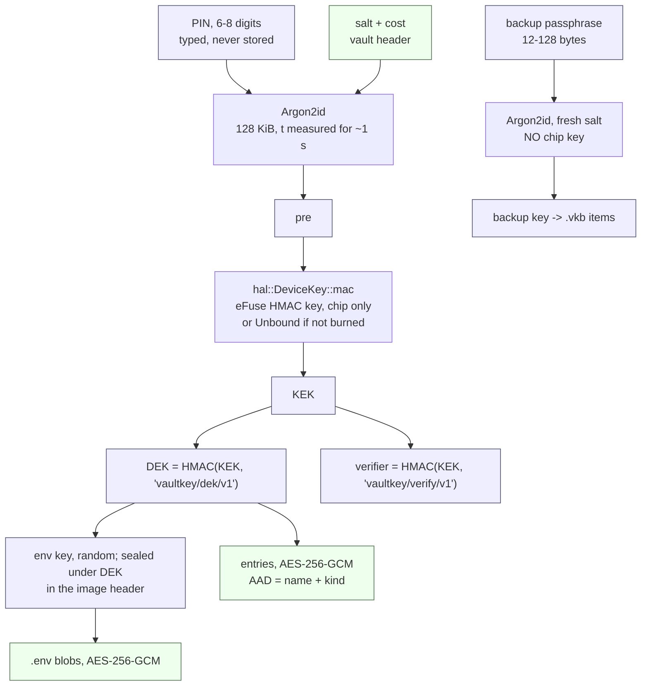

# Threat model

> The main document of this project. Written **before** any sale, not after. Its purpose
> is that nobody uses this key believing it protects against something it does not.
> There is no sale today, and the document holds all the same: the owner must not rely
> on guarantees the device does not give.

Last reviewed 2026-09-09. Revisited on every hardware or firmware change. Reporting
policy: [`SECURITY.md`](../SECURITY.md). Board details: [`docs/hardware.md`](hardware.md).

## What the device is

A USB key on an ESP32-C6 running its own firmware (`firmware/core` plus a board
directory). It stores TOTP secrets, passwords and project `.env` files under
AES-256-GCM, keyed from a 6–8 digit PIN that is never stored. Every code, password and
`.env` requires a physical button press; eight wrong PINs in a row wipe every secret.
The protocol has no "read the TOTP secret" command; passwords and `.env` files do pass
through the computer. The only other path a secret takes out is the encrypted backup below.

**This is not a secure element and not a certified device.** It is a general-purpose
microcontroller. JTAG is disabled by eFuse, the data key passes through an eFuse HMAC
key (2026-09-08), Secure Boot v2 is enabled (2026-09-09). Flash Encryption is **not**
enabled and is not planned: secrets are already under AES-256-GCM behind the eFuse HMAC,
the vault is written as raw words through `esp-storage`, which FE does not support, and
FE would protect only firmware code that is open anyway.

## Key derivation

Blue exists only in RAM while unlocked and is zeroized on lock; green lives in flash.
An unlock is checked against the verifier; nothing derived from the PIN is stored.

| Choice | Reason |
|---|---|
| Argon2id, 128 KiB, no allocator | Memory hardness removes the GPU advantage of PBKDF2 |
| Cost `t` in the vault header, bounded above | A forged header cannot park the key for hours |
| Not `scrypt`, not `balloon-hash` | `scrypt` needs `alloc`; `balloon-hash` doubles the crypto crates |
| PIN 6–8 digits | 4 digits is 10 000 candidates, which no KDF rescues |
| Chip key as a trait, `hal::DeviceKey` | The board supplies `esp_hal::hmac` when `KEY_PURPOSE_0 = HMAC_UP` (`ChipKey::detect`), else `Unbound`; the header records the binding, so firmware answering differently returns `Incompatible` instead of burning attempts |
| Kind in the AAD with the name | The kind sits in flash as plaintext; without it one rewritten byte plus CRC would turn a TOTP secret into a "password" the reveal gesture hands out |

The eFuse burn of 2026-09-08 put 32 bytes from `/dev/urandom` into `BLOCK_KEY0`, purpose
`HMAC_UP`, read and write disabled, and set `DIS_USB_JTAG` and `DIS_PAD_JTAG` = 1. No copy
was kept (`shred`): a key in a file makes a flash dump useful again. The vault written
before the burn became `Incompatible` and was wiped.

## Gestures and entry kinds

| Gesture | Action | LED |
|---|---|---|
| Tap | code, password (with note), `.env` | amber |
| Hold 5 s | wipe | red |
| Double tap, 800 ms window | encrypted backup export | blue |

A tap never wipes and never exports; a hold never exports; a double tap never wipes. One
gesture would defend badly: a hostile host asks for a wipe exactly when the owner expects
a code, and the same reflex hands it over. A new command with consequences gets a new
gesture, never an existing one.

| Kind | May ever leave the device | Gesture |
|---|---|---|
| `Totp` | The code only — the secret has no path to `respond` under any gesture | tap |
| `Password` | Login without a gesture, under PIN (not a secret; the site asks for it first), then password and note | tap |
| `Env` | The whole blob, up to `ENV_MAX` = 8000 bytes | tap |

A password comes out on the same tap as a code (2026-09-08): for a single owner a separate
2 s hold cost more than it protected, and it is **not coming back**. The price: a hostile
host asking for a password while the owner expects a code gets it — but only for an entry
whose name it knows, only while unlocked by PIN, one per press. A `.env` is the same tap
and the most expensive on the key, releasing every secret of a project at once; with no
file on disk that is the only way to launch the project, and a separate gesture would add
nothing beyond PIN plus tap.

Rejected as confirmation: `sudo` (the device cannot see host privileges — the same bytes
arrive over the wire, and anything with port access can send them), BOOT+RESET (a reset
with BOOT held hands the chip to the ROM loader, invisible to firmware),
`USB_JTAG_BRIDGE_EN` via the PAC (needs `unsafe`; an eFuse closes it better). `--no-touch`
was removed: without the button a hostile host would harvest codes for future windows.

## What it protects against

| Threat | Verdict |
|---|---|
| Malware copying the secret database off the host | Yes — a secret goes in once and never comes back out; there is no export like an authenticator app's |
| Silent code generation in the background | No code without a **new** press: a held or taped-down button does not count — confirmation is a press with a release, after the request |
| A wipe disguised as a code request | Yes — different gesture, different LED |
| A password request disguised as a code request | No — same tap, deliberately (above) |
| An ordinary thief with the board | Yes, through the protocol: PIN plus a wiping attempt counter, the attempt spent **before** the check, so cutting power mid-check buys no free attempts |

Honest boundary: none of this stops the owner (eight wrong PINs or `espflash erase-flash`
wipe just as well), and it does not protect against anyone holding the board with
equipment and time. It protects against what the owner did not intend to do.

### Backup — encrypted, and only on a double tap

`vkey backup` (2026-09-09) writes every entry and `.env` blob into one `.vkb` file. Each
item is sealed by **the device itself** (AES-256-GCM) as `kind | name | secret` under a key
derived from a backup passphrase (Argon2id, fresh salt, same cost as the PIN; 12–128
characters, because the file is brute-forced offline with no attempt counter) and
**without** the chip key, or the file would not open on another board. The host assembles
the file (`cli/src/backup.rs`) and never looks inside: a TOTP secret does not leave in the
clear here either. `BACKUP_AAD` plus the item index covers each item's position, so a
reordered, substituted or repeated item does not open; a truncated file restores what it
holds and reports how much; the first item *is* the passphrase check (`BadBackup`, nothing
written).

What this changes: a file now exists that, with the passphrase, equals every secret, and
its strength is the passphrase's — keep it where you keep other backups, and the
passphrase elsewhere. Host malware during `backup` gets the same ciphertext the owner
gets; it cannot swap a code request for an export, and it can substitute its own
passphrase only if the owner happens to double tap, which is never needed otherwise.
`vkey restore` writes the file back under PIN with no gesture, like `add`: nothing comes
out, a duplicate name replaces, and entry versus blob the newer one from the file wins.
Rejected: a flash-image copy as backup — PIN-encrypted, 8 digits fall offline in days, and
it does not transfer while bound to the chip key.

## What it does not protect against

| Threat | Why not |
|---|---|
| Phishing | A TOTP code typed into a fake site works on the real one. That is a property of TOTP, not of the device; only WebAuthn/passkey stops phishing, and it is **not** here and never will be on this board |
| The code, password or `.env` you just received | It passes through USB, the terminal and optionally the clipboard; host malware sees it at that moment |
| A host fully compromised at the moment of use | It waits for your press and takes the result; with no display the device cannot show what you are confirming |
| A breach at the service | TOTP is a shared secret: the service stores it too |
| A plaintext export on disk before `vkey import` | The CSV exists before and after the import |
| Flash erasure by anyone holding the board | ROM download mode stays open on purpose (limitation 2) |
| A state-level attack | Supply chain, hardware modification: a small project controls neither |

The device protects the **secret** that generates all future codes, not one code. A
password is worse than a code: it lives for years. The CLI clears a clipboard password
after 30 s, and a password's note goes to the screen only, never the clipboard. That is
the price of having no display; the only thing that reduces it is that display requires a
press and never happens on its own. Recovery codes belong in that note (as does a
1Password Secret Key or a security-question answer), and on the key they are a **copy, not
a backup**: the service issues them in case the 2FA device is lost, so if TOTP and the
codes sit on the same key, losing it takes both. Their home is paper away from the key.

`.env` is worse still: dozens of secrets in one display, and the most convenient use —
`vkey get myapp > .env` — puts them back on disk in the clear, exactly where they were
supposed to stop being. Hence [`README.md`](../README.md) shows launching with no file
(`env $(vkey get myapp) command`) and tmpfs for the rest. Input is no better: in the shell
an `.env` is pasted into the terminal, usually through the clipboard, which any process in
the session can read and which a clipboard manager writes to on-disk history; the CLI never
touched that clipboard and does not clear it. And the key is a working copy, not a backup:
eight wrong PINs wipe the `.env` along with everything else. Likewise `vkey import` reads
the CSV that Google Password Manager and 1Password export in the clear; anything that sees
the disk sees it — trash, backups, cloud sync, filesystem snapshots. The CLI reads it into
zeroized memory and prints no password, but does not delete the file: that is irreversible,
and until the device is verified the file is the only copy. The owner's rule: export to
tmpfs (`/dev/shm`), import, delete — `shred -u` guarantees nothing on an SSD or a
copy-on-write filesystem. For 1Password no export is needed at all: `op read ... | vkey
pass add` passes the secret through a pipe.

## Known limitations

Listed openly so nobody has to discover them.

1. **Not a secure element.** Researcher Courk published a power-glitch bypass of Secure
   Boot on the ESP32-C3 and ESP32-C6 (Espressif AR2023-007): an attacker with a few hundred
   dollars of equipment and a few hours can potentially extract the contents of the chip.
   Power-glitch attacks are **not addressed**, and Secure Boot does not close them.
2. **Secure Boot v2 is enabled (2026-09-09), with limits.** The ROM runs only a bootloader,
   and the bootloader only an image, signed with the project key: firmware that would wait
   for the PIN, or brute force it with access to the HMAC peripheral (Argon2id runs on a
   GPU, the chip only answers HMAC — days instead of years), no longer runs, and the
   remaining key slots are revoked. But ROM download mode stays enabled on purpose —
   without it there is no firmware update and no eFuse read — so anyone holding the board
   can **erase or rewrite flash** without running any code. In practice: erase the attempt
   sector and brute force the PIN through the real firmware over USB at ~1.3 s per attempt
   with a rewrite after every seven (8 digits means years), or erase the vault, the same
   effect as eight wrong PINs.
3. **The signing key is part of the model.** Losing it freezes the firmware forever;
   leaking it returns everything to the pre-Secure-Boot state.
4. **The app image is not padded to the 64 KiB MMU page.** espflash cannot do
   `--secure-pad-v2`, so the tail of the last page after the signature is mapped
   unverified. Practical exploitability has not been assessed.
5. **The encryption key is bound to an eFuse HMAC key** (burned 2026-09-08), so a flash
   dump alone no longer allows offline PIN brute-forcing — an attacker also needs the chip,
   and no copy of the key exists. The attempt counter still protects only the path over the
   protocol.
6. **No FIDO certification** and no listing in the FIDO Metadata Service.
7. **No display** — the device cannot show what it is confirming.
8. **No recovery mechanism** beyond the encrypted backup (`vkey backup` / `vkey restore`).
   Lose both the key and the backup and access is gone. Keep a second key.

## Honest comparison

| | This key | Phone authenticator app | YubiKey 5 (OATH) |
|---|---|---|---|
| Secret never leaves the device in the clear | **Yes**; backup is encrypted on the device itself, behind a separate gesture | No: cloud backup, plaintext export | Yes |
| Button press per code | **Yes** | No | Yes (touch) |
| PIN with wipe | **Yes**, 6–8 digits, Argon2id | Phone passcode | OATH password |
| Passwords and their notes (recovery codes) | **Yes**, shown only after a press | Separate app | No (OATH) |
| Project `.env` files | **Yes**, whole, after a press; up to 16 files of 8000 bytes | 1Password Environments, in the cloud | No |
| Resistance to physical attacks | Partial: flash dump useless without the chip, foreign firmware will not run (Secure Boot v2); with the chip — PIN brute force through the real firmware with the counter erased, power glitching | No | Secure element, not absolute |
| Backup | One file under a backup passphrase, restorable to any vkey | Yes, in the cloud | None |
| Phishing resistance | No | No | No (OATH) |
| Open source, reflashable | **Yes** | No | No |

No illusions about secure elements either: the **EUCLEAK** attack (NinjaLab, 2024) allowed
cloning a YubiKey 5 through a side channel in an Infineon crypto library, after 14 years
and roughly 80 Common Criteria evaluations. "Certified" does not mean "unbreakable" —
choose by threat model, not by stickers.

## Who it suits

Suits: a second factor for personal accounts when you do not want secrets on a phone and
in a cloud backup — **this is the main scenario**; and anyone who wants open hardware and
control over the firmware.

Does not suit: anyone expecting phishing protection (**get a passkey/WebAuthn key**);
anyone expecting resistance to physical seizure of the key (**a certified key with an
SE**); use as a sole factor or without the services' own recovery codes — the wipe after
8 wrong PINs is final, and a backup exists only if one was made and the passphrase not
forgotten.

## Marketing wording rules

Breaking these rules is, by our own definition, project failure.

**Must not be written:**

- "phishing-proof" / "protects against phishing" — TOTP does not do this
- "safer than YubiKey"
- "military grade", "unbreakable", "hardware-grade security"
- "certified", "FIDO compliant"
- "qualified electronic signature carrier"

**Can and should be written:**

- "secrets never leave the device in the clear; the backup is a file encrypted on the key
  itself, no cloud"
- "every code needs a physical button"
- "an open key you can audit and reflash yourself"
- "not a secure element — the threat model is in the documentation", linking directly here

A link to this document belongs on the product page, not buried in the repository.

## Sources

- [RFC 6238 — TOTP](https://www.rfc-editor.org/rfc/rfc6238) · [RFC 4226 — HOTP](https://www.rfc-editor.org/rfc/rfc4226)
- [Fault Injection Attacks against the ESP32-C3 and ESP32-C6 — Courk](https://courk.cc/esp32-c3-c6-fault-injection)
- [Espressif Security Advisory AR2023-007](https://www.espressif.com/en/news/ESP32_FIA_Analysis)
- [EUCLEAK Side-Channel Attack on the YubiKey 5 Series — NinjaLab](https://ninjalab.io/wp-content/uploads/2024/09/20240903_eucleak.pdf)
- [Security Overview — ESP32-C6, ESP-IDF](https://docs.espressif.com/projects/esp-idf/en/latest/esp32c6/security/security.html)
